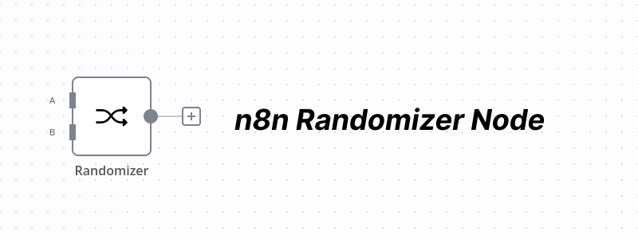

# n8n-nodes-randomizer

This node helps you to select random input A or B.

Two Randomization modes are available:
- `Randomize`: Randomly selects either input A or B.
- `Percentage Randomize`: Randomly selects either input A or B, based on the percentage of the input A.

## Installation

- Follow the community node installation guide [here](https://docs.n8n.io/integrations/community-nodes/installation/).

### License
- MIT
